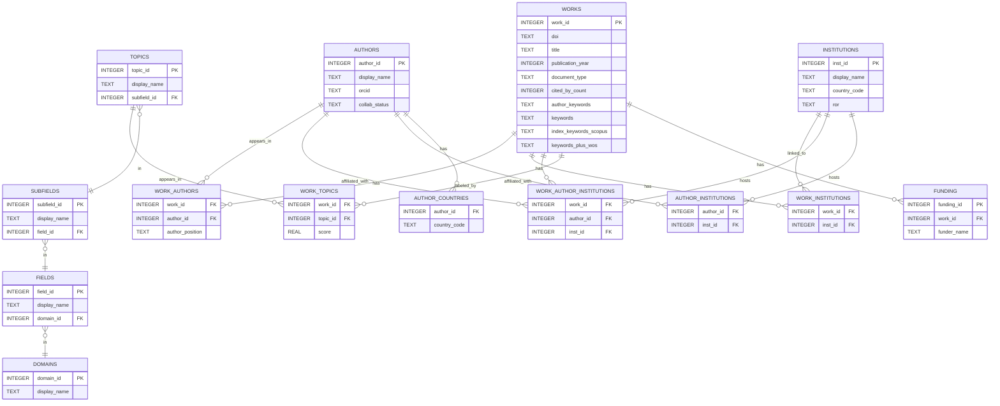

## Analytics database: `indo_swiss_research.db` (SQLite)

Built by `create_SQLite.R`. It loads the OpenAlex hierarchy and the parquet deliverables from the Phase 1 Data assembly. Types are SQLite defaults.

**Important Schema Changes:**
- All OpenAlex IDs are converted to INTEGER primary keys by stripping letter prefixes (W, A, I, T, F, S, D)
- Consistent use of OpenAlex nomenclature: 'work' instead of 'publication'
- Institution relationships use `inst_id` and `ror` consistently across all tables

Tables (columns — brief description):

- `domains`
  - `domain_id`: PK; OpenAlex domain id (INTEGER)
  - `display_name`, `description`: text
  - `works_count`: OpenAlex works count
  - `created_date`, `updated_date`: timestamps

- `fields`
  - `field_id`: PK; OpenAlex field id (INTEGER, stripped 'F' prefix)
  - `display_name`, `description`
  - `works_count`: OpenAlex works count
  - `domain_id`: FK → `domains.domain_id`
  - `created_date`, `updated_date`

- `subfields`
  - `subfield_id`: PK; OpenAlex subfield id (INTEGER, stripped 'S' prefix)
  - `display_name`, `description`
  - `works_count`: OpenAlex works count
  - `field_id`: FK → `fields.field_id`
  - `created_date`, `updated_date`

- `topics`
  - `topic_id`: PK; OpenAlex topic id (INTEGER, stripped 'T' prefix)
  - `display_name`, `description`, `works_count`
  - `subfield_id`: FK → `subfields.subfield_id`
  - `created_date`, `updated_date`

- `works`
  - `work_id`: PK (INTEGER, stripped 'W' prefix)
  - `doi`, `title`, `publication_date`, `publication_year`
  - `document_type`, `cited_by_count`, `is_oa`, `source_display_name`
  - `abstract`, `language`, `volume`, `issue`, `first_page`, `last_page`, `pdf_url`, `landing_page_url`
  - `author_keywords`, `keywords`, `index_keywords_scopus`, `keywords_plus_wos`: keyword fields (TEXT)
  - `created_date`, `updated_date`

- `authors`
  - `author_id`: PK (INTEGER, stripped 'A' prefix)
  - `display_name`, `orcid`
  - `works_count`, `cited_by_count`, `h_index`, `i10_index`
  - `collab_status`: {`Joint`,`Both`,`IN`,`CH`,`None`}
  - `total_institutions`, `total_countries`, `n_corresponding_works`
  - `created_date`, `updated_date`

- `institutions`
  - `inst_id`: PK (INTEGER, stripped 'I' prefix); OpenAlex institution id
  - `ror`: ROR id
  - `display_name`, `country_code`, `type`, `homepage_url`, `image_url`, `thumbnail_url`
  - `latitude`, `longitude`, `city`, `region`
  - `works_count`, `cited_by_count`
  - `created_date`, `updated_date`

- `work_authors`
  - `work_id`: FK → `works.work_id`
  - `author_id`: FK → `authors.author_id`
  - `author_position`, `is_corresponding`
  - `raw_affiliation_string`
  - PK: (`work_id`, `author_id`, `author_position`)

- `work_author_institutions`
  - `work_id`: FK → `works.work_id`
  - `author_id`: FK → `authors.author_id`
  - `inst_id`: FK → `institutions.inst_id`
  - PK: (`work_id`, `author_id`, `inst_id`)

- `author_institutions`
  - `author_id`: FK → `authors.author_id`
  - `inst_id`: FK → `institutions.inst_id`
  - `n_works`: number of works for the (author, inst)
  - PK: (`author_id`, `inst_id`)

- `author_countries`
  - `author_id`: FK → `authors.author_id`
  - `country_code`: ISO
  - `n_works`: number of works for the (author, country)
  - PK: (`author_id`, `country_code`)

- `work_topics`
  - `work_id`: FK → `works.work_id`
  - `topic_id`: FK → `topics.topic_id`
  - `score`: topic_score
  - `is_primary`: boolean
  - PK: (`work_id`, `topic_id`)

- `work_institutions`
  - `work_id`: FK → `works.work_id`
  - `inst_id`: FK → `institutions.inst_id`
  - PK: (`work_id`, `inst_id`)

- `funding`
  - `funding_id`: autoincrement PK
  - `work_id`: FK → `works.work_id`
  - `funder_name`, `funder_id`, `award_id`, `funding_text`

- `update_log`
  - `update_id`: autoincrement PK
  - `update_type`, `start_date`, `end_date`, `records_added`, `update_source`, `notes`

- `sqlite_sequence`
  - Internal SQLite table for autoincrement sequences
  - `name`, `seq`

Views:
- `indo_swiss_works`: works with at least one IN and one CH institution
- `topic_hierarchy`: `topics` → `subfields` → `fields` → `domains`
- `work_with_topics`: `works` joined to `work_topics` and `topics`

Canonical keys:
- `work_id`, `author_id`, `inst_id`, `topic_id` across tables (all INTEGER, stripped letter prefixes)

---

## D. High-level connections (ER diagram)



## F. Schema verification helpers (R — run locally)

```r
library(arrow)
library(DBI)
library(RSQLite)
library(dplyr)
library(vctrs)
library(purrr)

describe_parquet <- function(path) {
  cat("\n=== ", path, " ===\n", sep = "")
  dt <- arrow::read_parquet(path)
  cat("Rows:", nrow(dt), "\n")
  cat("Columns:", ncol(dt), "\n")
  tibble(name = names(dt), type = map_chr(dt, vctrs::vec_ptype_full))
}

# Parquet assets
describe_parquet('Data/publications_full_dataset_2000-2024.parquet')
describe_parquet('Data/authors_processed_flat.parquet')
describe_parquet('Data/authors_summary_with_lists.parquet')
describe_parquet('Data/work_institution_links.parquet')
describe_parquet('Data/work_topic_links.parquet')

# SQLite schemas
db_cols <- function(db_path) {
  con <- dbConnect(RSQLite::SQLite(), db_path)
  on.exit(dbDisconnect(con), add = TRUE)
  tables <- dbListTables(con)
  for (t in tables) {
    cat("\n--- ", t, " ---\n", sep = "")
    print(dbGetQuery(con, paste0("PRAGMA table_info(", t, ")"))[, c('name','type','pk')])
  }
}

db_cols('openAlex_topics.sqlite')
db_cols('indo_swiss_research.db')
```


